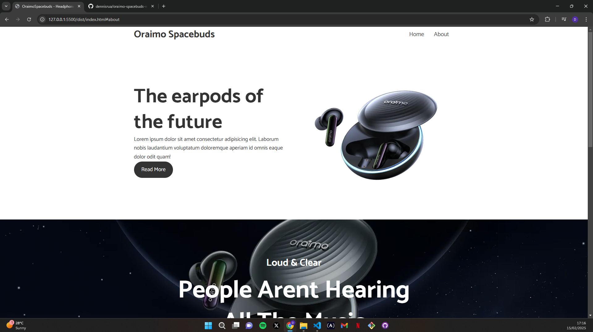
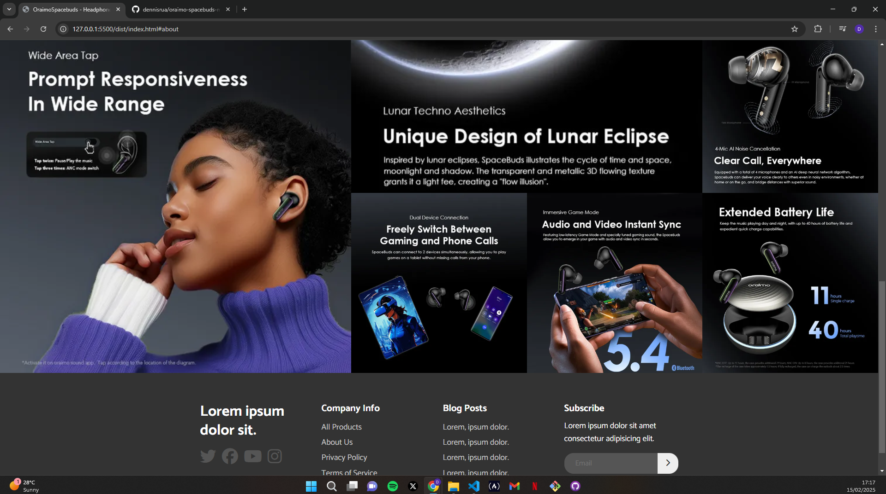

# Oraimo Spacebuds Mockup Website

A responsive mockup website for Oraimo Spacebuds showcasing modern web design techniques and best practices in front-end development.

## Introduction

This repository contains a responsive, modern mockup website for Oraimo Spacebuds. Built as a portfolio project, the website demonstrates modern design principles, responsive layouts, and a clean, intuitive interface. It serves as a showcase of front-end development skills using HTML, CSS and a little bit of jQuerry for responsiveness.

## Features

- **Responsive Design:** Optimized for mobile, tablet, and desktop screens.
- **Modern UI/UX:** Clean, intuitive, and user-friendly interface design.
- **Interactive Elements:** Smooth and engaging user interactions.
- **Well-Organized Code:** Modular and maintainable code structure with clear comments.

## Installation

To set up and run the project locally, follow these steps:

1. **Clone the repository:**

   ```bash
   git clone https://github.com/yourusername/oraimo-spacebuds-mockup.git

   ```

2. **Navigate to the project directory**

```bash
   cd oraimo-spacebuds-mockup

```

3. **Open the project**

- Launch your preferred code editor
- Open dist folder to view the mockup.

## Usage

This is a static website project. To explore its design and functionality:

- Simply open the index.html file in any modern web browser.
- Customize the HTML and CSS files as needed to experiment with design changes or add new features.

## Screenshots




## Technologies Used

- HTML5
- CSS3
- jQuerry

## Credits

- Design inspiration: Oraimo Spacebuds
- Developed by: https://github.com/dennisrua

## Disclaimer!!

This project is an unofficial mockup created solely for demonstration and portfolio purposes. It is **not affiliated with, endorsed by, or in any way officially connected to Oraimo Spacebuds** or its owners. All product names, logos, and trademarks are the property of their respective owners.
